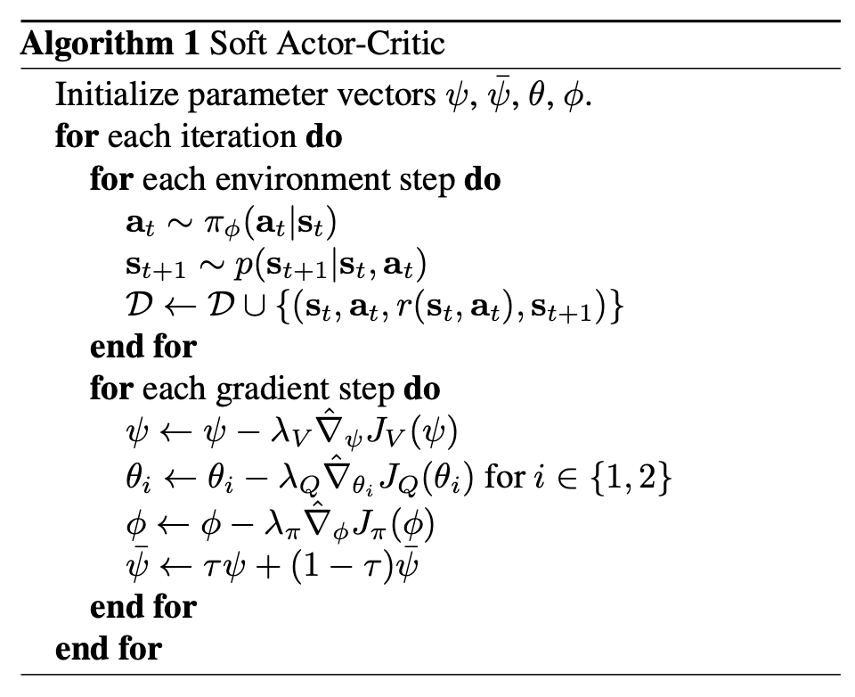

## Soft Actor-Critic: Off-Policy Maximum Entropy Deep Reinforcement Learning with a Stochastic Actor

### Abstract

>Prior deep RL methods based on this framework have been formulated as Q-learning methods. By combining off-policy updates with a stable stochastic actor-critic formulation, our method achieves state-of-the-art performance on a range of continuous control benchmark tasks, outperforming prior on-policy and off-policy methods. 

#### Introduction and Approach

As a physics major, I believe there is an important concept that some physics majors may not be familiar with: the idea that **a neural network is a universal function approximator**. Understanding this concept makes it much easier to approach this paper and grasp its mathematical framework.

The key to understanding this algorithm lies in analyzing the mathematical equations and the role of each function within the framework. The critical functions in the **Soft Actor-Critic (SAC) algorithm**—such as the **Q-function**, **policy function**, and **value function**—are not just abstract mathematical constructs. In practice, these functions are implemented using neural networks, which approximate them based on the training data.

Once you understand that neural networks can approximate these functions with sufficient accuracy, it becomes clear how the algorithm operates. The neural networks act as the “physical structure” that embodies the mathematical functions, allowing the algorithm to learn optimal policies through reinforcement learning. By focusing on the mathematics behind the algorithm and the specific roles of these functions, we can break down SAC step by step, making its concepts more accessible even to those new to reinforcement learning.

#### Starting from Maxium Entropy Objective

To understand the  SAC, we need to start by defining its **cost function**, also referred to as the **objective**, as is the case with any optimization algorithm. The objective for SAC is the **maximum entropy objective**. This function is composed of two key components: the **policy** and the **entropy of the policy**. The goal of this objective is twofold, to maximize rewards and entropies. The policy is optimized to select actions that lead to the highest cumulative rewards. The entropy term encourages the policy to maintain randomness or unpredictability in its action selection, promoting exploration. 

Mathematically, the objective is expressed as:
$$
J(\pi)=\sum^{T}_{t=0} E_{(\bold{s}_t,\bold{a}_t)\sim\rho_{\pi}}\left[r(\bold{s}_t,\bold{a}_t)+\alpha\mathcal{H}(\pi(\cdot\vert\bold{s}_t))\right].
$$
$\pi(\bold{a}\vert \bold{s})$ represents a **probability distribution** that specifies the likelihood of taking action $a$ given the state $s$. In the field of artificial intelligence (AI), this distribution is commonly referred to as the **policy**. 

$r(\bold{s}_t, \bold{a}_t)$ represents the **reward** obtained by the agent at time step $t$. The reward is a scalar value provided by the environment, which quantifies the immediate benefit (or cost) of taking a specfic action $\bold{a}_t$ while being in a particular state $\bold{s}_t$.

$\mathcal{H}(\pi(\cdot \vert \bold{s}_t))$ represents the **entropy** of the policy $\bold{\pi}$ at a given state $\bold{s}_t$. Entropy, in this context, measures the **randomness** or **uncertainty** in the action selection process. A higher entropy value indicates that the policy has a more uniform probability distribution over possible actions, meaning the agent is exploring more. 

Based on the SAC paper, the entropy term $\mathcal{H}(\bold{\pi}(\cdot \vert \bold{s}_{t}))$ is specifically defined using the logarithmic function to measure the randomness of the policy $\bold{\pi}$.

The entropy term is given by:
$$
\mathcal{H}(\pi(\cdot \vert s_t))=-\int\pi(a\vert s_t)\log \pi(a \vert s_t)da
$$
($\int P(x)\log P(x) dx$ is maximized when $P(x)$, a probability distribution, is uniformly distributed.)

#### Is Maxium Entropy Objective Tractable in Continuous Space? 

While the maximum entropy objective is theoretically sound, its direct computation becomes **intractable in continuous spaces**. The primary challenge arises because, in such spaces, there are an **infinite number of states** and corresponding **actions**. This leads to the integral (or summation in discrete spaces) becoming effectively infinite. In other words, to comput $J(\pi)$, one would need to evaluate the reward and entropy terms for every possible combination of states and actions, which is computationally infeasible in practice. 

#### How we Approximate it

I see the SAC as an algorithm that cleverly solves this bottleneck by approximating the intractable objective in an effective and practical way. Instead of exhaustively evaluating the infinite combinations of states and actions, SAC uses a combination of sampling techniques and neural network approximations to make the computation feasible.

#### Three Functions We Want to Approximate

To apply **neural network approximation**, we first need to reformulate the objective function $J(\pi)$ by expressing it with separate functions that hold meaningful roles in the learning process. By doing so, we establish a strategy that allows the neural network to learn and approximate the optimal solution using data collected from interactions with the environment.

In the SAC paper, as previously mentioned, there are three key functions that the neural networks approximate:

1. Q-function $Q(\bold{s}_t, \bold{a}_t)$
2. soft state value function $V(\bold{s}_t)$ 
3. policy $\pi(\bold{a}_t \vert \bold{s}_t)$.

Let’s first introduce the **Q-function**. The Q-function quantifies the **value** of a specific **state-action pair** at a given time step $t$. More specifically, it evaluates not only the **immediate reward** obtained by taking action $\bold{a}_t$ in state $\bold{s}_t$ , but also the **potential future rewards** that can be obtained by following a given policy in subsequent time steps. This property makes the Q-function fundamental in reinforcement learning because it **captures the long-term impact** of an action, rather than just its short-term consequence.

If we have the **optimal Q-function** at each time step, we can directly derive the **optimal policy** from it. Now, we want to approximate this optimal Q-function in continuous space within the deep reinforcement learning framework.

To approximate the Q-function, we rely on the **Bellman backup operator**, which provides a recursive decomposition of the value function, enabling iterative learning.

Starting from any function Q: $\mathcal{S} \times \mathcal{A} \to \mathbb{R}$ , the **soft Bellman backup operator** $\mathcal{T}^\pi$ is applied repeatedly:
$$
\mathcal{T}^\pi Q(\bold{s}_t, \bold{a}_t) \triangleq r(\bold{s}_t, \bold{a}_t) + \gamma \mathbb{E}_{\bold{s}_{t+1} \sim p} [V(\bold{s}_{t+1})]
$$
where the **soft state value function** $V(\bold{s}_t) $ is defined as:
$$
V(\bold{s}_t) = \mathbb{E}_{\bold{a}_t \sim \pi} \left[ Q(\bold{s}_t, \bold{a}_t) - \log \pi(\bold{a}_t | \bold{s}_t) \right]
$$
By applying the Bellman backup operator iteratively, it is proven that the **Q-function converges** under the given policy $\pi$. This convergence property is referred to as **Soft Policy Evaluation**, ensuring that repeated application leads to a stable value estimation.

Once we have an improved estimate of the Q-function, the next step is to update the policy to maximize the expected return. In SAC, the policy update is performed by minimizing the **Kullback-Leibler (KL) divergence**, ensuring that the new policy is closer to an exponential distribution of the updated Q-values:
$$
\pi_{\text{new}} = \arg \min_{\pi} D_{\text{KL}} \left( \pi(\cdot | \bold{s}_t) \Big\| \frac{\exp(Q^\pi(\bold{s}_t, \bold{a}_t))}{Z(\bold{s}_t)} \right)
$$
This policy improvement step results in the following **inequality**, which guarantees that the updated policy achieves higher expected returns:
$$
V_{\pi_{\text{new}}}(\bold{s}_t) \geq V{\pi_{\text{old}}}(\bold{s}_t)
$$
This property, known as **Soft Policy Improvement**, ensures that each policy update step results in a better policy than before.

By combining **soft policy evaluation** and **soft policy improvement**, the SAC paper introduces the key theoretical result that guarantees convergence to an optimal policy.
$$
\text{Theorem 1: Repeated application of soft policy evaluation and soft policy improvement from any} \\ \pi \in \Pi
\text{ converges to a policy } \pi^* \text{ such that } Q^{\pi^*}(\bold{s}_t, \bold{a}_t) \geq Q^{\pi}(\bold{s}_t, \bold{a}_t) \text{ for all } \pi \in \Pi \text{ and } (\bold{s}_t, \bold{a}_t) \in \mathcal{S} \times \mathcal{A},\\ \text{ assuming } |\mathcal{A}| < \infty.
$$

#### How to Implement it in Code

From here, we will introduce how to implement the above theorem in code. To let the neural network approximate Q-function $Q_{\theta}(\bold{s}_t, \bold{a}_t)$, the soft value function $V_{\psi}(\bold{s}_t)$, and the policy $\pi_{\phi}(\bold{s}_t)$, we need to define the respective cost functions that will guide the training of the neural networks using the parameters $\theta$, $\psi$, and $\phi$.

The soft value function $V_\psi(\bold{s}_t)$ is trained to minimize the square residual error:
$$
J_V(\psi)=\mathbb{E}_{\bold{s}_t\sim\mathcal{D}}\left[ \frac{1}{2}\left( V_{\psi}(\bold{s}_t)-\mathbb{E}_{\bold{a}_t\sim \pi_{\phi}}[Q_\theta(s_t, \bold{a}_t)-\log\pi_{\phi}(\bold{a}_t \vert \bold{s}_t)]\right)^2 \right]
$$
Where $\mathcal{D}$ is the distribution of previously sampled states and actions, or a replay buffer. 

The soft Q-function $Q_{\theta}(\bold{s}_t, \bold{a}_t)$ is trained to minimize the square residual error:
$$
J_{Q}(\theta)=\mathbb{E}_{(\bold{s}_t, \bold{a}_t)\sim\mathcal{D}}\left[\frac{1}{2}\left(Q_{\theta}(\bold{s}_t, \bold{a}_t)-\hat{Q}(\bold{s}_t, \bold{a}_t)\right)^2\right]
$$
with 
$$
\hat{Q}(\bold{s}_t,\bold{a}_t)=r(\bold{s}_t, \bold{a}_t)+\gamma\mathbb{E}_{\bold{s}_{{t+1}_\sim p}}[V_\bar{\psi}(\bold{s}_{t+1})]
$$
The update makes use of a target value network $V_{\bar{\psi}}$, where $\bar{\psi}$ can be an exponentially moving average of  the value network weights, which has been shown to stabilize training.

Finally, the policy parameters can be learned by directly minimizing the expected  KL-divergence as:
$$
J_\pi(\phi)=\mathbb{E}_{\bold{s}_t \sim \mathcal{D}}\left[D_{\text{KL}} \left( \pi(\cdot | \bold{s}_t) \Big\| \frac{\exp(Q^\pi(\bold{s}_t, \bold{a}_t))}{Z(\bold{s}_t)} \right) \right]
$$

