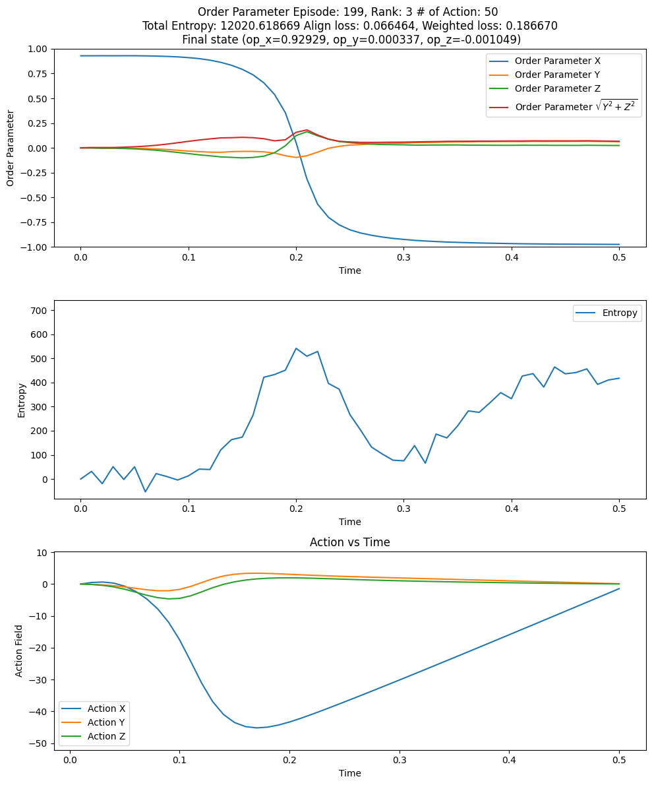

### Equation of motions

$$
\frac{d\boldsymbol{r}_i}{dt}=\boldsymbol{v}_i
\\
\frac{d\boldsymbol{v}_i}{dt}=-\frac{\partial \mathcal{H}}{\partial \boldsymbol{v}_i}+\boldsymbol{\xi}_i=-J\sum_{j}n_{ij}(t)(\boldsymbol{v}_i-\boldsymbol{v}_j)-g(\vert \boldsymbol{v}_i\vert-v_0)\frac{\boldsymbol{v}_i}{\vert \boldsymbol{v}_i \vert}+\boldsymbol{h}+\boldsymbol{\xi}_i
\\
\\
-\frac{\partial \mathcal{H}}{\partial \boldsymbol{v}_i}
=-J\sum_{j}n_{ij}(t)(\boldsymbol{v}_i-\boldsymbol{v}_j)-g(\vert \boldsymbol{v}_i\vert-v_0)\frac{\boldsymbol{v}_i}{\vert \boldsymbol{v}_i \vert}+\boldsymbol{h}
$$

### Stratonovich convention

$$
\int^{T}_0 X_t\circ dW_t
=\sum^{k-1}_{i=0}\frac{X_{t_{i+1}}+X_{t_i}}{2}(W_{t_{i}+1}-W_{t_i})
$$

#### Onsager-Machlup Action with the External Field of Foward Trajectory

$$
\text{Let $F(t)$ hold the interaction term and the constraint term.}
\\
\boldsymbol{F}(t)=-J\sum_{j}n_{ij}(t)(\boldsymbol{v}_i-\boldsymbol{v}_j)-g(\vert \boldsymbol{v}_i\vert-v_0)\frac{\boldsymbol{v}_i}{\vert \boldsymbol{v}_i \vert}
\\
\text{Onsager-Machulp action of foward trajectory can be expressed as follows.}
\\
S[\boldsymbol{v}(t), \boldsymbol{r}(t)|\boldsymbol{v}(0),\boldsymbol{r}(0)]=\frac{1}{4T}\sum_{i, \alpha}\int^{t}_{0}dt'\bigg{[}\dot{v}^{\alpha}_{i}(t')-F^{\alpha}_{i}(t')-h^{\alpha}(t')\bigg{]}^2
\\
=\frac{1}{4T}\sum_{i, \alpha}\int^{t}_{0}dt'\bigg{[}\frac{d{v}^{\alpha}_{i}(t')}{dt'}-F^{\alpha}_{i}(t')-h^{\alpha}(t')\bigg{]}^2
\\
\text{Express the above in Stratonovich convention.}
\\
=\frac{1}{4T}\sum_{i, \alpha}\sum_{k}\Delta t\bigg{[}\frac{v^{\alpha}_{i}(t_{k+1})-v^{\alpha}_{i}(t_{k})}{\Delta t}-\frac{F^{\alpha}_{i}(t_{k+1})+F^{\alpha}_{i}(t_{k})}{2}\ -\frac{h^{\alpha}(t_{k+1})+h^{\alpha}(t_{k})}{2} \bigg{]}^2
$$

### Onsager-Machulp Action with the External Field of Backward Trajectory

$$
\text{Onsager-Machulp action of backward trajectory can be expressed as follows.}
\\
\\
S[\boldsymbol{v}^{\dagger}(t), \boldsymbol{r}^{\dagger}(t)|\boldsymbol{v}^{\dagger}(0),\boldsymbol{r}^{\dagger}(0)]
\\
=\frac{1}{4T}\sum_{i, \alpha}\sum_{k}\bigg{[}-\bigg{(}v^{\alpha}_{i}(t-t_{k+1})-v^{\alpha}_{i}(t-t_{k})\bigg{)}
+\frac{F^{\alpha}_{i}(t-t_{k+1})+F^{\alpha}_{i}(t-t_{k})}{2}\Delta t
-\frac{h^{\alpha}(t-t_{k+1})+h^{\alpha}(t-t_{k})}{2}\Delta t \bigg{]}^2
\\
\\
\text{From here, apply the change of variables.}
\\
\tau_{k+1}=t-t_k
\\
\tau_{k}=t-t_{k+1}
\\
\tau_{k+1}-\tau_{k}=\Delta t
\\
\\
S[\boldsymbol{v}^{\dagger}(t), \boldsymbol{r}^{\dagger}(t)|\boldsymbol{v}^{\dagger}(0),\boldsymbol{r}^{\dagger}(0)]
\\
=\frac{1}{4T}\sum_{i, \alpha}\sum_{k}\Delta t \bigg{[}-\frac{v^{\alpha}_{i}(\tau_{k})-v^{\alpha}_{i}(\tau_{k+1})}{\Delta t}+\frac{F^{\alpha}_{i}(\tau_{k})+F^{\alpha}_{i}(\tau_{k+1})}{2}
-\frac{h^{\alpha}(\tau_{k})+h^{\alpha}(\tau_{k+1})}{2} \bigg{]}^2
\\
=\frac{1}{4T}\sum_{i, \alpha}\sum_{k}\Delta t\bigg{[}\frac{v^{\alpha}_{i}(\tau_{k+1})-v^{\alpha}_{i}(\tau_{k})}{\Delta t}+\frac{F^{\alpha}_{i}(\tau_{k+1})+F^{\alpha}_{i}(\tau_{k})}{2}
-\frac{h^{\alpha}(\tau_{k+1})+h^{\alpha}(\tau_{k})}{2} \bigg{]}^2
$$

### Entropy Production Calculation with External Field

$$
\text{Onsager-Machulp Action of Foward Trajectory}
\\
\\
S[\boldsymbol{v}(t), \boldsymbol{r}(t)|\boldsymbol{v}(0),\boldsymbol{r}(0)]
\\
=\frac{1}{4T}\sum_{i, \alpha}\sum_{k}\Delta t\bigg{[}\frac{v^{\alpha}_{i}(t_{k+1})-v^{\alpha}_{i}(t_{k})}{\Delta t}-\frac{F^{\alpha}_{i}(t_{k+1})+F^{\alpha}_{i}(t_{k})}{2}\ -\frac{h^{\alpha}(t_{k+1})+h^{\alpha}(t_{k})}{2} \bigg{]}^2
\\
\\
\text{Onsager-Machulp Action of Backward Trajectory}
\\
\\
S[\boldsymbol{v}^{\dagger}(t), \boldsymbol{r}^{\dagger}(t)|\boldsymbol{v}^{\dagger}(0),\boldsymbol{r}^{\dagger}(0)]
\\
=\frac{1}{4T}\sum_{i, \alpha}\sum_{k}\Delta t\bigg{[}\frac{v^{\alpha}_{i}(t_{k+1})-v^{\alpha}_{i}(t_{k})}{\Delta t}+\frac{F^{\alpha}_{i}(t_{k+1})+F^{\alpha}_{i}(t_{k})}{2}
-\frac{h^{\alpha}(t_{k+1})+h^{\alpha}(t_{k})}{2} \bigg{]}^2
\\
\\
\text{Entropy Production}
\\
S[\boldsymbol{v}^{\dagger}(t), \boldsymbol{r}^{\dagger}(t)|\boldsymbol{v}^{\dagger}(0),\boldsymbol{r}^{\dagger}(0)]-S[\boldsymbol{v}(t), \boldsymbol{r}(t)|\boldsymbol{v}(0),\boldsymbol{r}(0)]
\\
=\frac{1}{4T}\sum_{i, \alpha}\sum_{k}\Delta t\bigg{[}\frac{v^{\alpha}_{i}(t_{k+1})-v^{\alpha}_{i}(t_{k})}{\Delta t}+\frac{F^{\alpha}_{i}(t_{k+1})+F^{\alpha}_{i}(t_{k})}{2}\ -\frac{h^{\alpha}(t_{k+1})+h^{\alpha}(t_{k})}{2} \bigg{]}^2
\\
-\frac{1}{4T}\sum_{i, \alpha}\sum_{k}\Delta t\bigg{[}\frac{v^{\alpha}_{i}(t_{k+1})-v^{\alpha}_{i}(t_{k})}{\Delta t}-\frac{F^{\alpha}_{i}(t_{k+1})+F^{\alpha}_{i}(t_{k})}{2}
-\frac{h^{\alpha}(t_{k+1})+h^{\alpha}(t_{k})}{2} \bigg{]}^2
\\
\\
=\frac{1}{4T}\sum_{i, \alpha}\sum_{k}\Delta t \bigg{[}2\frac{v^{\alpha}_{i}(t_{k+1})-v^{\alpha}_{i}(t_{k})}{\Delta t}\bigg{(} \frac{F^{\alpha}_{i}(t_{k+1})+F^{\alpha}_{i}(t_{k})}{2} -\frac{h^{\alpha}(t_{k+1})+h^{\alpha}(t_{k})}{2} \bigg{)}
\\
+2\frac{v^{\alpha}_{i}(t_{k+1})-v^{\alpha}_{i}(t_{k})}{\Delta t}\bigg{(} \frac{F^{\alpha}_{i}(t_{k+1})+F^{\alpha}_{i}(t_{k})}{2} +\frac{h^{\alpha}(t_{k+1})+h^{\alpha}(t_{k})}{2} \bigg{)}
\\
+\bigg{(} \frac{F^{\alpha}_{i}(t_{k+1})+F^{\alpha}_{i}(t_{k})}{2} -\frac{h^{\alpha}(t_{k+1})+h^{\alpha}(t_{k})}{2} \bigg{)}^2
\\
-\bigg{(} \frac{F^{\alpha}_{i}(t_{k+1})+F^{\alpha}_{i}(t_{k})}{2} +\frac{h^{\alpha}(t_{k+1})+h^{\alpha}(t_{k})}{2} \bigg{)}^2
\bigg{]}
\\
\\
=\frac{1}{4T}\sum_{i, \alpha}\sum_{k}\Delta t\bigg{[}  4\frac{v^{\alpha}_{i}(t_{k+1})-v^{\alpha}_{i}(t_{k})}{\Delta t}\frac{F^{\alpha}_{i}(t_{k+1})+F^{\alpha}_{i}(t_{k})}{2} -4\bigg{(}\frac{F^{\alpha}_{i}(t_{k+1})+F^{\alpha}_{i}(t_{k})}{2} \bigg{)}\bigg{(}\frac{h^{\alpha}(t_{k+1})+h^{\alpha}(t_{k})}{2} \bigg{)} \bigg{]}
\\
=\frac{1}{4T}\sum_{i, \alpha}\sum_{k}\Delta t\bigg{[}   4\bigg{(}\frac{v^{\alpha}_{i}(t_{k+1})-v^{\alpha}_{i}(t_{k})}{\Delta t}-\frac{h^{\alpha}(t_{k+1})+h^{\alpha}(t_{k})}{2}\bigg{)} \bigg{(}\frac{F^{\alpha}_{i}(t_{k+1})+F^{\alpha}_{i}(t_{k})}{2} \bigg{)}  \bigg{]}
$$

### Entropy Production Analysis (Modifed version)

$$
\text{Entropy production: } \frac{1}{4T}\sum_{i, \alpha}\sum_{k}\Delta t\bigg{[}   4\bigg{(}\frac{v^{\alpha}_{i}(t_{k+1})-v^{\alpha}_{i}(t_{k})}{\Delta t}-\frac{h^{\alpha}(t_{k+1})+h^{\alpha}(t_{k})}{2}\bigg{)} \bigg{(}\frac{F^{\alpha}_{i}(t_{k+1})+F^{\alpha}_{i}(t_{k})}{2} \bigg{)}  \bigg{]}
\\
\text{Interaction term: }\frac{1}{4T}\sum_{i, \alpha}\sum_{k}4\Delta t\bigg{(} \frac{v^{\alpha}_{i}(t_{k+1})-v^{\alpha}_{i}(t_{k})}{\Delta t}\bigg{)}\bigg{[}-\frac{J}{2}\sum_{j}\bigg{(}n_{ij}(t_{k+1})({v}^{\alpha}_i(t_{k+1})-{v}^{\alpha}_j(t_{k+1}))+n_{ij}(t_{k})({v}^{\alpha}_i(t_{k})-{v}^{\alpha}_j(t_{k}))\bigg{)}\bigg{]}
\\
\text{Constraint term: }\frac{1}{4T}\sum_{i, \alpha}\sum_{k}4\Delta t\bigg{(} \frac{v^{\alpha}_{i}(t_{k+1})-v^{\alpha}_{i}(t_{k})}{\Delta t}\bigg{)}\bigg{[}-\frac{g}{2}\bigg{(}\vert \boldsymbol{v}_i(t_{k+1})\vert-v_0\bigg{)}\frac{v^{\alpha}_i(t_{k+1})}{\vert \boldsymbol{v}_i(t_{k+1})\vert}-\frac{g}{2}\bigg{(}\vert \boldsymbol{v}_i(t_k)\vert-v_0\bigg{)}\frac{{v}^{\alpha}_i(t_k)}{\vert \boldsymbol{v}_i(t_{k})\vert}\bigg{]}
\\
\text{Field term: }\frac{1}{4T}\sum_{i, \alpha}\sum_{k}4\Delta t\bigg{[}   -\bigg{(}\frac{h^{\alpha}(t_{k+1})+h^{\alpha}(t_{k})}{2}\bigg{)} \bigg{(}\frac{F^{\alpha}_{i}(t_{k+1})+F^{\alpha}_{i}(t_{k})}{2} \bigg{)}  \bigg{]}
$$

$$
\boldsymbol{F}(t)=-J\sum_{j}n_{ij}(t)(\boldsymbol{v}_i-\boldsymbol{v}_j)-g(\vert \boldsymbol{v}_i\vert-v_0)\frac{\boldsymbol{v}_i}{\vert \boldsymbol{v}_i \vert}
\\
$$

### Simulation Result

$$
\\
\boldsymbol{h}=
\begin{cases}
(0, 0, 0)& 0\leq t \leq 50\\
(1, 0, 0)& 50\leq t \leq 100\\
(-1, 0, 0)& 100\leq t \leq 150\\
(5, 0, 0)& 150\leq t \leq 200

\end{cases}
$$

​													Value= Production/time(=0.1)

### Entropy Production Analysis (Previous version)

$$
\text{Entropy production: } \frac{1}{4T}\sum_{i, \alpha}\sum_{k}4\Delta t\bigg{[}   \bigg{(}\frac{v^{\alpha}_{i}(t_{k+1})-v^{\alpha}_{i}(t_{k})}{\Delta t}\bigg{)} \bigg{(}\frac{F^{\alpha}_{i}(t_{k+1})+F^{\alpha}_{i}(t_{k})}{2}+\frac{h^{\alpha}(t_{k+1})+h^{\alpha}(t_{k})}{2} \bigg{)}  \bigg{]}
\\
\text{Interaction term: }\frac{1}{4T}\sum_{i, \alpha}\sum_{k}4\Delta t\bigg{(} \frac{v^{\alpha}_{i}(t_{k+1})-v^{\alpha}_{i}(t_{k})}{\Delta t}\bigg{)}\bigg{[}-\frac{J}{2}\sum_{j}\bigg{(}n_{ij}(t_{k+1})({v}^{\alpha}_i(t_{k+1})-{v}^{\alpha}_j(t_{k+1}))+n_{ij}(t_{k})({v}^{\alpha}_i(t_{k})-{v}^{\alpha}_j(t_{k}))\bigg{)}\bigg{]}
\\
\text{Constraint term: }\frac{1}{4T}\sum_{i, \alpha}\sum_{k}4\Delta t\bigg{(} \frac{v^{\alpha}_{i}(t_{k+1})-v^{\alpha}_{i}(t_{k})}{\Delta t}\bigg{)}\bigg{[}-\frac{g}{2}\bigg{(}\vert \boldsymbol{v}_i(t_{k+1})\vert-v_0\bigg{)}\frac{v^{\alpha}_i(t_{k+1})}{\vert \boldsymbol{v}_i(t_{k+1})\vert}-\frac{g}{2}\bigg{(}\vert \boldsymbol{v}_i(t_k)\vert-v_0\bigg{)}\frac{{v}^{\alpha}_i(t_k)}{\vert \boldsymbol{v}_i(t_{k})\vert}\bigg{]}
\\
\text{Field term: }\frac{1}{4T}\sum_{i, \alpha}\sum_{k}4\Delta t\bigg{(} \frac{v^{\alpha}_{i}(t_{k+1})-v^{\alpha}_{i}(t_{k})}{\Delta t}\bigg{)}\bigg{(}\frac{h^{\alpha}(t_{k+1})+h^{\alpha}(t_{k})}{2} \bigg{)}
$$

### Simulation Result

$$
\\
\boldsymbol{h}=
\begin{cases}
(0, 0, 0)& 0\leq t \leq 50\\
(1, 0, 0)& 50\leq t \leq 100\\
(-1, 0, 0)& 100\leq t \leq 150\\
(5, 0, 0)& 150\leq t \leq 200

\end{cases}
$$

Measured over 0.01s intervals, with data points recorded every 0.01s

### Entropy Production Rate

### 1000 initial states

$$
L_x=13, L_y=13, L_z=13, \rho=0.25, v_0=4.00, J=1.50, g=4.00, T=1.00, dt=0.001, \text{steady state time}=50
$$

### Training Algorithm Flow

1. **Initialize Population**:

Start by creating 5 initial “scarecrows” (representing the neural networks). Set all their weight parameters to 0.

2. **Mutation**:

Mutate each of the 5 scarecrows to produce 2 offspring per scarecrow. Now, we have a total of 10 scarecrows.

3. **Select Initial State**:

Randomly choose an initial state from 1000 possible steady-state configurations of the thermodynamic system.

4. **Evaluation**:

Evaluate the performance of the 10 scarecrows on the system. 
To ensure stability against thermal fluctuations, compute the weighted loss for each scarecrow by taking the average over 100 evaluations.

5. **Selection**:

Select the best 5 scarecrows based on their performance. These will become the “parents” for the next generation.

6. **Repeat**:

Repeat steps 2 to 5 for 200 generations to evolve the neural networks and improve their ability to control the system.

10 steady state * 10 trajectory -> average loss

1 steady state * 100 trajectory -> average loss (검증)

the first one can be more general.

### Questions

 In our last meeting, we left off discussing the number of actions in the control setup. Luke’s paper presents an analytical solution where the external field is continuously controlled. However, in our neural network model, the number of actions to adjust the external field is finite.

Since the neural network functions as a continuous mapping from input to output, it naturally interpolates between discrete actions based on its input. **The key question is: what is the optimal number of actions that balances computational efficiency and maintains the physical relevance of the control?**

In terms of physical interpretation, the number of actions should match how finely we can actually control the system. **Choosing too few actions might oversimplify the control dynamics, while too many could introduce unnecessary complexity without a corresponding gain in precision.**

### Ideas

Information engine -> Why different path? -> May modify the governing equation.

1. direction reversal optimal path
2. Quenching optimal path (Mpemba effect)

### 24.10.04

Understanding the system deeper.

#### System Dynamics at T=1.00

Simulation setting
$$
L_x=13, L_y=13, L_z=13, \rho=0.25, v_0=4.00, J=1.50, g=4.00, T=1.00, dt=0.001
$$

$$
\\
\boldsymbol{h}=
\begin{cases}
(0, 0, 0)& 0\leq t \leq 50\\
(1, 0, 0)& 50\leq t \leq 100\\
(-1, 0, 0)& 100\leq t \leq 150\\
(5, 0, 0)& 150\leq t \leq 200

\end{cases}
$$

Measured over 0.001s intervals, with data points recorded every 1s

Center of Mass에 카메라 앵글을 둬서, particle transparency high

Field가 커지면 군집이 작아져서 interaction range내 particle의 개수가 줄어드므로 interaction force가 줄어든다.

군집이 생기면 entropy production이 크다. temperature가 큰 것과 비교해보니 비슷한 경향성을 보인다.

g가 커야 active matter의 activeness가 커지므로 g가 작으면 whitelam ising 과 비슷 g가 크면 다름
$$
\text{Entropy production: } \frac{1}{4T}\sum_{i, \alpha}\sum_{k}\Delta t\bigg{[}   4\bigg{(}\frac{v^{\alpha}_{i}(t_{k+1})-v^{\alpha}_{i}(t_{k})}{\Delta t}-\frac{h^{\alpha}(t_{k+1})+h^{\alpha}(t_{k})}{2}\bigg{)} \bigg{(}\frac{F^{\alpha}_{i}(t_{k+1})+F^{\alpha}_{i}(t_{k})}{2} \bigg{)}  \bigg{]}
\\
\text{Interaction term: }\frac{1}{4T}\sum_{i, \alpha}\sum_{k}4\Delta t\bigg{(} \frac{v^{\alpha}_{i}(t_{k+1})-v^{\alpha}_{i}(t_{k})}{\Delta t}\bigg{)}\bigg{[}-\frac{J}{2}\sum_{j}\bigg{(}n_{ij}(t_{k+1})({v}^{\alpha}_i(t_{k+1})-{v}^{\alpha}_j(t_{k+1}))+n_{ij}(t_{k})({v}^{\alpha}_i(t_{k})-{v}^{\alpha}_j(t_{k}))\bigg{)}\bigg{]}
\\
\text{Constraint term: }\frac{1}{4T}\sum_{i, \alpha}\sum_{k}4\Delta t\bigg{(} \frac{v^{\alpha}_{i}(t_{k+1})-v^{\alpha}_{i}(t_{k})}{\Delta t}\bigg{)}\bigg{[}-\frac{g}{2}\bigg{(}\vert \boldsymbol{v}_i(t_{k+1})\vert-v_0\bigg{)}\frac{v^{\alpha}_i(t_{k+1})}{\vert \boldsymbol{v}_i(t_{k+1})\vert}-\frac{g}{2}\bigg{(}\vert \boldsymbol{v}_i(t_k)\vert-v_0\bigg{)}\frac{{v}^{\alpha}_i(t_k)}{\vert \boldsymbol{v}_i(t_{k})\vert}\bigg{]}
\\
\text{Field term: }\frac{1}{4T}\sum_{i, \alpha}\sum_{k}4\Delta t\bigg{[}   -\bigg{(}\frac{h^{\alpha}(t_{k+1})+h^{\alpha}(t_{k})}{2}\bigg{)} \bigg{(}\frac{F^{\alpha}_{i}(t_{k+1})+F^{\alpha}_{i}(t_{k})}{2} \bigg{)}  \bigg{]} 
$$
온도가 높을 때 dv가 더 

$\sigma=\sqrt{\frac{\sum^{n}_{i=1}(x-\bar{x})^2}{N}}$

Measured over 0.001s intervals, with data points recorded every 0.001s

자기장이 없을때 activeness에 의한 entropy production (constraint work) contribution을 키우자

자기장이 있을때 passiveness up!

자기장을 키우고 줄이고의 과정에서 information engine으로서 entropy를 어떻게 뽑아낼 수 있는가?

자기장이 있으면 activeness가 죽어버림!!

interaction term entropy production이 activeness에 의해 발생

entropy production은 backward trajectory 대비 forward trajectory 의 확률비를 생각해볼 때 constraint term은 적을 것이고

interaction term이 클 것. -> 충돌과 산란 두 경우 비

**activeness가 interaction entropy production과 연관이 있음을 함수적으로 표현하는 논문, 방식을 찾아보고 발전시키기**

**When field is applied, entropy production can be reduced.**

It is hard to understand the relation between the force and entropy.

#### Particle Dynamics at T=1.00

Measured over 0.001s intervals, with data points recorded every 1s

**When field is applied, interaction force decreases.**

**When field is applied, constraint force increases.**

Measured over 0.001s intervals, with data points recorded every 0.1s

#### System Dynamics at T=10.0

Simulation setting
$$
L_x=13, L_y=13, L_z=13, \rho=0.25, v_0=4.00, J=1.50, g=4.00, T=5.00, dt=0.001
$$

$$
\\
\boldsymbol{h}=
\begin{cases}
(0, 0, 0)& 0\leq t \leq 50\\
(1, 0, 0)& 50\leq t \leq 100\\
(-1, 0, 0)& 100\leq t \leq 150\\
(5, 0, 0)& 150\leq t \leq 200

\end{cases}
$$

Measured over 0.001s intervals, with data points recorded every 1s

Sqrt(10) = 3.xx

T=1 일때 dv와 T=10일때 dv가 3배 커짐

grouping에 따라서 force 영향이 크다

groupinggksmsrp 

짧은 시간에서 간격에서 dv는 온도가 결정하겠지만 (Thermal noise) 긴 시간의 dv는 dH/dv에 의해서 결정될 것. 
dv plot이 particle-wise, short time scale이기 때문에 micro scalef로 생각하면 이는 thermal noise가 dominant

Measured over 0.001s intervals, with data points recorded every 0.001s

#### Particle Dynamics T=10

Measured over 0.001s intervals, with data points recorded every 1s

Measured over 0.001s intervals, with data points recorded every 0.1s

#### Flocking Model Control

**# of actions: 200**

Z rotation preference -> why? Numeric error?

**# of actions: 100**

**# of actions: 50**

**# of actions: 25**

**# of actions: 10**

Loss function에 final state에서 system의 군집정도(inverse participation ratio)를 추가

Constraint term에 존재감을 키워야함 activeness

 

결국 alignment loss가 중요하다기 보다는 flocking의 군집 정도와 대략적인 방향이 중요할듯

결국 trade off이고 리뷰어들을 설득할 정도의 수준만 갖추자

**IPR**

system size, cell size에 따라 IPR이 dependency

Signature of irreversibility in microscopic models of flocking에서는 interaction이 EPR을 만들어내는데 그러면 우리 constraint term이 -인 경우에 대해서는 뭘까..?
